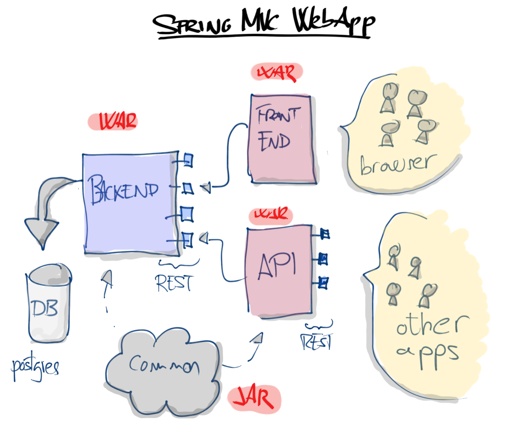

# WebApp Template
Java, Spring MVC template.  
Provides the basic functionallity to build a web application with:

* front-end
    * bootstrap
    * javascript
    * json
* back-end
    * json
    * database capabilities: postgres
* configuration files
    * properties files separated by environment

Besides some extra utilities to deal and manipulate Strings, Files and Json.

# Architecture

The schema above represents an overview of the general architecture. Very simple design with three war files:

* BACKEND: Communicates with the data base and expose the REST services to be consumed by the front-end.
* FRONTEND: Consumes the services from Backend and shows the data on a gui based on Bootstrap.
* API: Consumes the services from Backend and expose external services for third parties to consume.

And one jar file:
* COMMON: Provides common utilities for all the other modules.